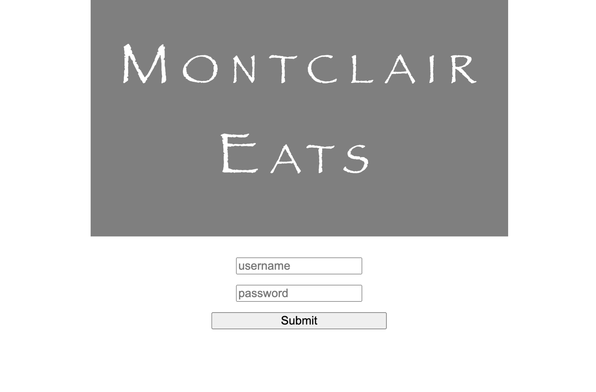
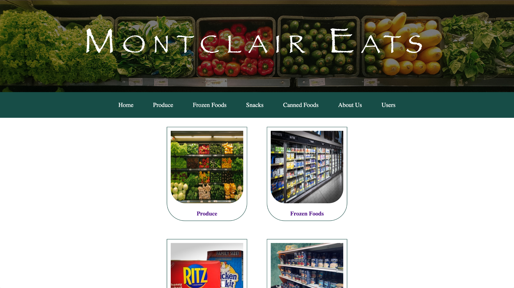
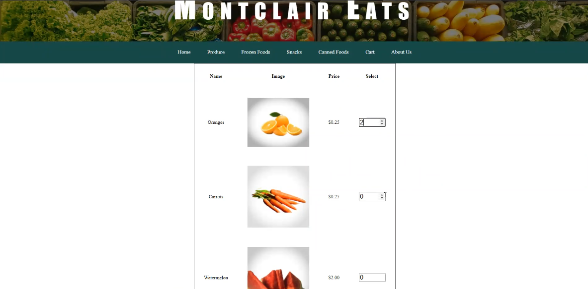
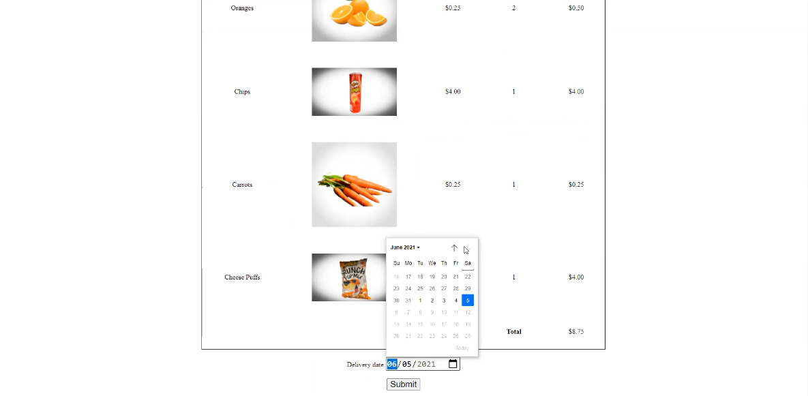

<h1>Montclair Eats Grocery Store</h1>

This web application is for a fictional grocery store in Montclair, New Jersey. It was created as part of a group project for a college course. Through the website, groceries can be selected for purchase and a delivery date can be set for when the groceries will be received by the customer.

Included in the web application is a login page and different permission levels for general users, employees, managers, and system administrators. This website was developed with PHP and MySQL.

<em>Disclaimer: This web application is for example/educational purposes only and shouldn't be used for an actual grocery store website.</em>

<h3>Login Page</h3>

<h3>Home Page</h3>

<h3>Store Page</h3>

<h3>Cart Page</h3>

